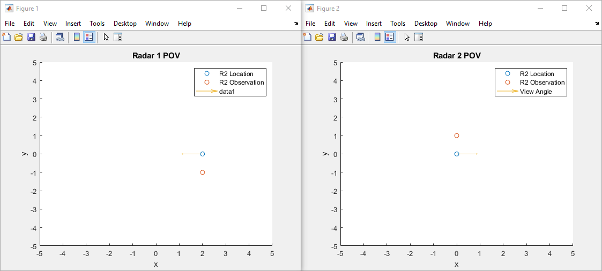

# Data Fusion

<https://github.com/distributed-radar/data-fusion>

## Class Structure

* RadarNode
  * Observation List
  * Neighbor List
* Observation
  * Position and doppler data
* Neighbor
  * RadarNode
  * Position and view angle

## Example

This is the output of `TestOnePoint.m`.

